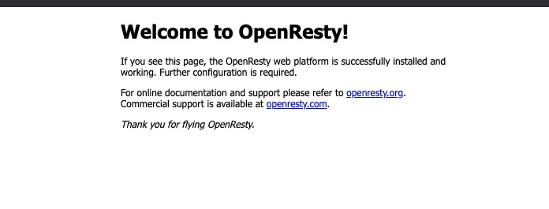

# 认证网关初体验

## 本节通过openrestry + lua 完成一个认证网关的两个核心逻辑：认证和代理

* 认证方面，系统通过lua 的数组完成一个简单的身份数组配置。
* 服务方面通过python 的 SimpleHTTPServer 作为一个假想的后端服务。

## 开发环境搭建

1. 强烈建议你通过编译安装一次openrestry。 因为,通过编译，安装，配置，你可以深入了解openrestry 的各个模块。可以让你在安全开发的路上走得更远。
2. 鉴于开发调试方便，本节主要通过docker 来完成一个通用的openresty 的安装。
    开发之前需要安装好docker, 然后通过如下的命令完成docker 镜像的拉取运行  
    ```shell
    docker run -d -p 80:80 --name ops-gateway openresty/openresty:1.15.8.3-2-centos
    ```

    然后通过浏览器访问 http://localhost ,就可以呈现openrestry 的默认页面，则安装成功.

    